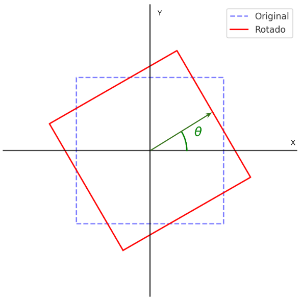

# Parcial 2 - Procesamiento de Imágenes con Buddy System.

### **Nombre del estudiante:** Mauricio David Correa H.

# Tabla de Contenido.

- [1. Conocimiento teórico de la rotación de una imagen.](#1-conocimiento-teórico-de-la-rotación-de-una-imagen)
    - [1. Transformación Directa.](#1-transformación-directa)
    - [2. Transformación Inversa.](#2-transformación-inversa)
    - [3. Por qué la transformación inversa es mejor](#3-por-qué-la-transformación-inversa-es-mejor)

- [2. Conocimiento teórico del escalamiento de una imagen utilizando Interpolación Bilineal.](#2-conocimiento-teórico-del-escalamiento-de-una-imagen-utilizando-interpolación-bilineal)
    - [1. Transformación de escalamiento.](#1-transformación-de-escalamiento)
    - [2. Interpolación Bilineal](#2-interpolación-bilineal)
    - [3. Ventajas de la Interpolación Bilineal.](#3-ventajas-de-la-interpolación-bilineal)
    - [4. Desventajas.](#4-desventajas)

- [3. Preguntas de análisis.](#3-preguntas-de-análisis)
    - [1. Qué diferencia observaste en el tiempo de procesamiento entre los dos modos de asignación de memoria](#1-qué-diferencia-observaste-en-el-tiempo-de-procesamiento-entre-los-dos-modos-de-asignación-de-memoria)

    - [2. Cuál fue el impacto del tamaño de la imagen en el consumo de memoria y el rendimiento.](#2-cuál-fue-el-impacto-del-tamaño-de-la-imagen-en-el-consumo-de-memoria-y-el-rendimiento)

    - [3. Por qué el Buddy System es más eficiente o menos eficiente que el uso de new/delete en este caso.](#3-por-qué-el-buddy-system-es-más-eficiente-o-menos-eficiente-que-el-uso-de-newdelete-en-este-caso)

    - [4. Cómo podrías optimizar el uso de memoria y tiempo de procesamiento en este programa.](#4-cómo-podrías-optimizar-el-uso-de-memoria-y-tiempo-de-procesamiento-en-este-programa)

    - [5. Qué implicaciones podría tener esta solución en sistemas con limitaciones de memoria o en dispositivos embebidos.](#5-qué-implicaciones-podría-tener-esta-solución-en-sistemas-con-limitaciones-de-memoria-o-en-dispositivos-embebidos)

    - [6. Cómo afectaría el aumento de canales (por ejemplo, de RGB a RGBA) en el rendimiento y consumo de memoria.](#6-cómo-afectaría-el-aumento-de-canales-por-ejemplo-de-rgb-a-rgba-en-el-rendimiento-y-consumo-de-memoria)

    - [7. Qué ventajas y desventajas tiene el Buddy System frente a otras técnicas de gestión de memoria en proyectos de procesamiento de imágenes.](#7-qué-ventajas-y-desventajas-tiene-el-buddy-system-frente-a-otras-técnicas-de-gestión-de-memoria-en-proyectos-de-procesamiento-de-imágenes)

- [4. Código.](#4-código)
    - [4.1. Buddy Allocator.](#41-buddy-allocator)
    - [4.2. Image.](#42-image)
    - [4.3. Measure Memory and Time.](#43-measure-memory-and-time)
    - [4.4. Process Image.](#44-process-image)
    - [4.5. Stb.](#45-stb)
    - [4.6. Utils.](#46-utils)
    - [4.7. Main.](#47-main)
    - [4.8. Makefile.](#48-makefile)

- [5. Compilación y ejecución.](#5-compilación-y-ejecución)
    - [Compilación.](#compilación)
    - [Ejecución.](#ejecución)

- [Video sustentación Parcial 2 - Sistemas Operativos](#6-video-sustentación-parcial-2---sistemas-operativos)


## **1. Conocimiento teórico de la rotación de una imagen.**

La rotación de imágenes es una de las transformaciones geométricas más utilizadas en el procesamiento digital de imágenes. Se emplea en diversas aplicaciones, como la alineación de imágenes, el reconocimiento de patrones y la visión por computadora.

Este proceso consiste en girar todos los píxeles de una imagen en torno a un punto fijo, generalmente el centro de la imagen, en un ángulo determinado. Sin embargo, debido a la naturaleza discreta de las imágenes digitales, la rotación no es un proceso trivial, ya que puede generar píxeles vacíos o desalineaciones si no se maneja correctamente.

Existen dos enfoques principales para aplicar la rotación:

- **Transformación directa**, donde cada píxel de la imagen original se mapea a una nueva posición en la imagen rotada.
- **Transformación inversa**, que recorre la imagen destino y calcula de dónde proviene cada píxel en la imagen original.

La transformación inversa es preferida en la mayoría de los casos, ya que evita la aparición de espacios vacíos en la imagen rotada. Para entender este proceso en detalle, es necesario analizar las ecuaciones matemáticas que definen la rotación en un espacio bidimensional.



***Figura 1: Rotación desde el centro de una imagen.***

#### **1. Transformación Directa.**

Supongamos que tenemos un punto $ P_{original} = (x_{original}, y_{original})$ en una imagen y queremos rotarlo $\theta$ grados alrededor de un punto central $P_{centro} = (x_{centro}, y_{centro})$.  

Primero, trasladamos el punto para que el centro de rotación quede en el origen:

$$x' = x_{original} - x_{centro}$$

$$y' = y_{original} - y_{centro}$$

Ahora, aplicamos la transformación de rotación:

$$x_{\text{rotado}} = x' \cos(\theta) - y' \sin(\theta)
$$
$$
y_{\text{rotado}} = x' \sin(\theta) + y' \cos(\theta)
$$

Finalmente, trasladamos de nuevo el punto al sistema original:

$$
x'' = x_{\text{rotado}} + x_{centro}
$$
$$
y'' = y_{\text{rotado}} + y_{centro}
$$

Reemplazamos $x_{rotado}$ y $y_{rotado}$ en $x''$ y $y''$, esto da la transformación directa:

$$
x'' = (x_{original} - x_{centro}) \cos(\theta) - (y_{original} - y_{centro}) \sin(\theta) + x_{centro}
$$
$$
y'' = (x_{original} - x_{centro}) \sin(\theta) + (y_{original} - y_{centro}) \cos(\theta) + y_{centro}
$$

Sin embargo, esto causa problemas en la imagen rotada porque algunos píxeles en la imagen destino quedan vacíos, ya que no todos los píxeles originales tienen una correspondencia exacta.

Para corregir el problema de los huecos en la imagen, en lugar de tomar cada píxel de la imagen original y moverlo a la nueva imagen, recorremos cada píxel en la imagen destino y calculamos de dónde vendría en la imagen original.

#### **2. Transformación Inversa.**

Para hacerlo, necesitamos **invertir la transformación directa**. Esto significa resolver el sistema para encontrar $P_{original}\ o\ sea \ (x,y)$ en función de $(x'', y'')$.

Sabemos que la transformación directa es:

$$x'' = (x_{original} - x_{centro}) \cos(\theta) - (y_{original} - y_{centro}) \sin(\theta) + x_{centro}$$
$$y'' = (x_{original} - x_{centro}) \sin(\theta) + (y_{original} - y_{centro}) \cos(\theta) + y_{centro}$$

Queremos despejar $x$ y $y$:

**Restamos $x_{centro}$ y $y_{centro}$ en ambos lados para centrar el sistema en el origen**:

$$
x'' - x_{centro} = (x_{original} - x_{centro}) \cos(\theta) - (y_{original} - y_{centro}) \sin(\theta)
$$
$$
y'' - y_{centro} = (x_{original} - x_{centro}) \sin(\theta) + (y_{original} - y_{centro}) \cos(\theta)
$$

$$
x_{\text{original}} = (x'' - x_{centro}) \cos(\theta) - (y'' - y_{centro}) \sin(\theta) + x_{centro}
$$
$$
y_{\text{original}} = (x'' - x_{centro}) \sin(\theta) + (y'' - y_{centro}) \cos(\theta) + y_{centro}
$$

#### **3. Por qué la transformación inversa es mejor.**
Cuando recorremos la imagen destino y usamos la transformación inversa, evitamos los problemas de la transformación directa:

- No hay huecos porque cada píxel en la imagen rotada recibe un valor.
- Interpolación bilineal se puede aplicar si el resultado de 
$(𝑥_{original},𝑦_{original})$ no es un píxel exacto.

## **2. Conocimiento teórico del escalamiento de una imagen utilizando Interpolación Bilineal.**

El escalamiento de imágenes es una operación fundamental en el procesamiento digital de imágenes, utilizada en aplicaciones como la compresión de imágenes, la visualización en diferentes resoluciones y la mejora de detalles en la visión por computadora.

El proceso de escalamiento implica cambiar el tamaño de una imagen aumentando o reduciendo su número de píxeles. Sin embargo, este cambio no es trivial, ya que una ampliación sin interpolación puede generar pérdida de detalles y una reducción sin un filtrado adecuado puede producir aliasing.

### **1. Transformación de escalamiento.**
El escalamiento en coordenadas $(x, y)$ de una imagen se define por:

$$
x' = S_x \cdot x
$$
$$
y' = S_y \cdot y
$$

donde $S_x$ y $S_y$ son los factores de escalamiento en los ejes horizontal y vertical, respectivamente. Un valor mayor que 1 implica una ampliación y un valor menor que 1 implica una reducción.

El problema principal del escalamiento es la asignación de valores de píxeles cuando la imagen se redimensiona. Si el nuevo tamaño de la imagen no coincide exactamente con una relación de enteros, es necesario interpolar valores de píxeles.

### **2. Interpolación Bilineal.**
La interpolación bilineal es una técnica común para calcular el valor de un píxel en una imagen escalada. En lugar de simplemente tomar el valor del píxel más cercano (como en la interpolación del vecino más próximo), la interpolación bilineal utiliza un promedio ponderado de los cuatro píxeles más cercanos para calcular un valor suavizado.

Dado un punto $(x', y')$ en la imagen escalada, la interpolación bilineal encuentra los cuatro píxeles vecinos $(x_1, y_1)$, $(x_2, y_1)$, $(x_1, y_2)$ y $(x_2, y_2)$ en la imagen original, y calcula el valor interpolado como:

$$
I(x', y') = (1 - dx)(1 - dy) I(x_1, y_1) + dx(1 - dy) I(x_2, y_1) + (1 - dx) dy I(x_1, y_2) + dx dy I(x_2, y_2)
$$

donde:
- $dx = x' - x_1$
- $dy = y' - y_1$

Este método proporciona una transición suave entre los píxeles y reduce el efecto de pixelación en la imagen escalada.

### **3. Ventajas de la Interpolación Bilineal.**
- Produce una imagen más suave en comparación con la interpolación del vecino más próximo.
- Reduce los artefactos visuales en la imagen escalada.
- Se puede calcular rápidamente en hardware gráfico y es eficiente para el procesamiento en tiempo real.

### **4. Desventajas.**
- Puede generar un ligero desenfoque en la imagen debido al promedio de valores de píxeles.
- No conserva detalles finos en comparación con métodos más avanzados como la interpolación bicúbica.

El uso de la interpolación bilineal es ideal cuando se requiere un balance entre eficiencia y calidad en el escalamiento de imágenes. Es ampliamente utilizada en editores de imagen, procesamiento de vídeo y aplicaciones de visión por computadora.

---

Este conocimiento teórico sienta las bases para la implementación del escalamiento de imágenes en el proyecto, asegurando que los resultados visuales sean adecuados para el procesamiento digital de imágenes.

## 3. Preguntas de análisis.

### 1. Qué diferencia observaste en el tiempo de procesamiento entre los dos modos de asignación de memoria.

El tiempo de procesamiento depende de cómo se maneja la memoria en cada caso:

* **Buddy System:** Tiende a ser más eficiente en la asignación y liberación de memoria porque maneja bloques de tamaño fijo, lo que reduce la fragmentación externa. Sin embargo, puede generar fragmentación interna cuando los bloques asignados son más grandes de lo necesario.

* **new/delete:** Este enfoque puede ser más lento debido a la sobrecarga de administración de memoria por parte del sistema operativo, ya que cada asignación y liberación de memoria implica llamadas a la API del sistema, lo que introduce latencia adicional.

En general, el Buddy System suele ser más rápido para la gestión de memoria dinámica en casos donde se realizan múltiples asignaciones y liberaciones.

### 2. Cuál fue el impacto del tamaño de la imagen en el consumo de memoria y el rendimiento.

* A medida que el tamaño de la imagen aumenta, el consumo de memoria también crece de manera proporcional.

* Con imágenes grandes, new/delete puede volverse ineficiente debido a la fragmentación de memoria y la sobrecarga de múltiples asignaciones.

* Buddy System maneja mejor la asignación de memoria cuando hay múltiples imágenes de distintos tamaños, pero si la imagen es demasiado grande, el sistema podría desperdiciar memoria debido a la fragmentación interna.

* En términos de rendimiento, el procesamiento de imágenes más grandes implica más operaciones de interpolación y transformación, lo que incrementa el tiempo de ejecución.

### 3. Por qué el Buddy System es más eficiente o menos eficiente que el uso de new/delete en este caso.

El Buddy System es más eficiente en la gestión de memoria porque:
* Reduce la fragmentación externa al dividir la memoria en bloques de tamaños predefinidos.
* Facilita la liberación de memoria al combinar bloques libres de manera jerárquica.
* Mejora la velocidad de asignación en comparación con new/delete, ya que evita la sobrecarga de las llamadas al sistema.

Sin embargo, puede ser menos eficiente en algunos casos porque:
* Puede desperdiciar memoria cuando los bloques asignados son más grandes de lo necesario (fragmentación interna).
* No es tan flexible como new/delete en situaciones donde los tamaños de memoria no encajan bien en la jerarquía del sistema.

### 4. Cómo podrías optimizar el uso de memoria y tiempo de procesamiento en este programa.

Algunas estrategias de optimización incluyen:

* **Uso eficiente del Buddy System:** Ajustar el tamaño mínimo de bloque para reducir la fragmentación interna.

* **Preasignación de memoria:** Reservar bloques grandes de memoria antes de procesar imágenes para evitar múltiples llamadas al sistema.

* **Paralelización:** Si el hardware lo permite, dividir la imagen en regiones y procesarlas en paralelo usando múltiples hilos.

* **Optimización de interpolación:** Usar métodos de interpolación optimizados (como SIMD) para acelerar el cálculo de píxeles en la transformación de imagen.

* **Liberación eficiente de memoria:** Implementar un sistema de reutilización de bloques en lugar de asignar y liberar constantemente.

### 5. Qué implicaciones podría tener esta solución en sistemas con limitaciones de memoria o en dispositivos embebidos.

En sistemas con recursos limitados, como dispositivos embebidos, se deben considerar varios factores:

* **Consumo de memoria:** El Buddy System puede ser útil para gestionar memoria limitada, pero debe ajustarse bien para evitar desperdicio por fragmentación interna.

* **Latencia:** Los dispositivos embebidos pueden tener restricciones en el acceso a la memoria, por lo que las operaciones de asignación deben ser rápidas y predecibles.

* **Tamaño de la imagen:** Procesar imágenes grandes puede superar la memoria disponible, por lo que sería necesario trabajar con técnicas como compresión o procesamiento en bloques.

* **Eficiencia energética:** La optimización del tiempo de procesamiento es clave en dispositivos con baterías limitadas.

En general, es recomendable ajustar los tamaños de los bloques del Buddy System para minimizar desperdicios y evitar asignaciones innecesarias en estos entornos.

### 6. Cómo afectaría el aumento de canales (por ejemplo, de RGB a RGBA) en el rendimiento y consumo de memoria.

* **Consumo de memoria:** Aumenta un 33% al agregar un canal alfa (de 3 a 4 bytes por píxel). Esto significa que una imagen de 1920x1080 pasaría de consumir ~6.2 MB a ~8.3 MB.

* **Tiempo de procesamiento:** Se incrementa porque cada píxel ahora tiene más información que manipular (más bytes por operación).

* **Carga en la memoria caché:** Procesar más datos por píxel puede afectar la eficiencia de la caché del procesador, generando más accesos a memoria RAM y reduciendo el rendimiento.

Para mitigar estos efectos, se pueden utilizar estructuras de datos optimizadas y técnicas como procesamiento vectorizado (SIMD) para mejorar la manipulación de píxeles.

### 7. Qué ventajas y desventajas tiene el Buddy System frente a otras técnicas de gestión de memoria en proyectos de procesamiento de imágenes.

| **Técnica** | **Ventajas** | **Desventajas** |
|------------|-------------|----------------|
| **Buddy System** | - Rápida asignación y liberación de memoria. <br> - Reduce la fragmentación externa. <br> - Eficiente en escenarios con tamaños de bloques bien definidos. | - Puede desperdiciar memoria por fragmentación interna. <br> - No es ideal para tamaños de memoria altamente variables. |
| **new/delete** | - Mayor flexibilidad en la asignación. <br> - Permite trabajar con tamaños de memoria arbitrarios. | - Mayor sobrecarga de procesamiento. <br> - Fragmentación de memoria con múltiples asignaciones y liberaciones. |
| **Malloc/Free** | - Más rápido que `new/delete` en algunos casos. <br> - Menos sobrecarga de administración. | - Fragmentación externa significativa. <br> - Puede ser más lento en grandes cantidades de asignaciones. |
| **Memory Pooling** | - Reduce la sobrecarga de asignaciones. <br> - Control total sobre la administración de memoria. | - Más difícil de implementar y mantener. <br> - Puede no ser eficiente si el tamaño de los objetos varía mucho. |

En **procesamiento de imágenes**, el Buddy System **es una buena opción** cuando las imágenes tienen tamaños predecibles y el rendimiento es crítico. Sin embargo, si los tamaños varían demasiado, técnicas como **Memory Pooling** pueden ser más eficientes.  


## 4. Código.

### 4.1. Buddy Allocator.

[buddy_allocator.h](buddy_system/buddy_allocator.h)
```cpp
/**
 * @file buddy_allocator.h
 * @author Mauricio David Correa Hernández.
 * @brief:  Definition of the BuddyAllocator class - The BuddyAllocator manages memory by splitting it into 
 * power-of-two sized blocks. When memory is allocated, the smallest suitable block is provided, and when 
 * freed, adjacent free blocks are merged back together.
 * @version 0.1
 * @date 2025-03-26
 * 
 * @copyright Copyright (c) 2025
 * 
 */


#ifndef BUDDY_ALLOCATOR_H
#define BUDDY_ALLOCATOR_H


#include <map>
#include <vector>
#include <cstdlib>
#include <cstdint>
#include <cstddef>
#include <iostream>
#include <algorithm>


using namespace std;


/**
 * @class BuddyAllocator
 * @brief A memory allocator implementing the Buddy System algorithm.
 */
class BuddyAllocator {
    public:
        /**
         * @brief Constructs a BuddyAllocator with a given memory size.
         * @param size_full_memory The total memory size to manage.
         */
        BuddyAllocator(size_t size_full_memory);

        /**
         * @brief Destructor that releases allocated memory.
         */
        ~BuddyAllocator();

        /**
         * @brief Allocates a block of memory of the requested size.
         * @param size The number of bytes to allocate.
         * @return Pointer to the allocated memory block, or nullptr if insufficient memory.
         */
        void* alloc(size_t size);
        
        /**
         * @brief Frees a previously allocated block of memory.
         * @param ptr Pointer to the memory block to free.
         * @param size The size of the memory block to be freed.
         */
        void free(void* ptr, size_t size);

    private:
        size_t size_full_memory; ///< Total memory size managed by the allocator.
        void* base_memory; ///< Pointer to the base memory block.
        std::map<size_t, std::vector<void*>> free_blocks; ///< Map of free memory blocks, categorized by size.
};

#endif
```

[buddy_allocator.cpp](buddy_system/buddy_allocator.cpp)
```cpp
/**
 * @file buddy_allocator.cpp
 * @author Mauricio David Correa Hernández.
 * @brief:  Implements the BuddyAllocator class for dynamic memory management.
 * @version 0.1
 * @date 2025-03-26
 * @copyright Copyright (c) 2025
 */


#include "buddy_allocator.h" // Include the header file


/**
 * @brief Constructor: assigns a memory block of the specified size.
 * @param size_full_memory The total size of the memory pool.
 */
BuddyAllocator::BuddyAllocator(size_t size_full_memory) {
    this->size_full_memory = size_full_memory;
    base_memory = std::malloc(size_full_memory);
    if (!base_memory) {
        cerr << "Error: Failed to allocate base memory with Buddy System.\n";
        exit(1);
    }

    // Initialize the structure with a single large block
    free_blocks[size_full_memory].push_back(base_memory);
}


/**
 * @brief Destructor: releases the reserved memory.
 */
BuddyAllocator::~BuddyAllocator() {
    std::free(base_memory);
}


/**
 * @brief Allocates memory of the given size using the Buddy System.
 * @param size The size of the memory block to allocate.
 * @return A pointer to the allocated memory, or nullptr if allocation fails.
 */
void* BuddyAllocator::alloc(size_t size) {
    // Find the smallest block that can be used
    auto it = free_blocks.lower_bound(size);
    if (it == free_blocks.end()) {
        cerr << "Error: Not enough memory to allocate " << size << " bytes.\n";
        return nullptr;
    }

    // Take the found block
    size_t blockSize = it->first;
    void* block = it->second.back();
    it->second.pop_back();
    if (it->second.empty()) {
        free_blocks.erase(it);
    }

    // Split the block if it is larger than necessary
    size_t currentSize = blockSize;
    while (currentSize > size) {
        currentSize /= 2;
        void* buddy = (char*)block + currentSize;
        free_blocks[currentSize].push_back(buddy);
    }

    return block;
}


/**
 * @brief Frees a previously allocated memory block.
 * @param ptr Pointer to the memory block to free.
 * @param size The size of the block being freed.
 */
void BuddyAllocator::free(void* ptr, size_t size) {
    if (!ptr) return;

    size_t currentSize = size;
    void* block = ptr;

    while (currentSize < size_full_memory) {
        uintptr_t block_addr = reinterpret_cast<uintptr_t>(block);
        uintptr_t buddy_addr = block_addr ^ currentSize;
        void* buddy = reinterpret_cast<void*>(buddy_addr);

        auto& blocksAtSize = free_blocks[currentSize];

        auto it = std::find(blocksAtSize.begin(), blocksAtSize.end(), buddy);
        if (it == blocksAtSize.end()) {
            blocksAtSize.push_back(block);
            return;
        }

        blocksAtSize.erase(it);
        block = (block_addr < buddy_addr) ? block : buddy;
        currentSize *= 2;
    }

    free_blocks[currentSize].push_back(block);
}
```

### 4.2. Image.

[image.h](image/image.h)
```cpp
/**
 * @file image.h
 * @author Mauricio David Correa Hernández.
 * @brief:  Definition of the Image class - Class representing an image and allowing its manipulation.
 * @version 0.1
 * @date 2025-03-26
 * 
 * @copyright Copyright (c) 2025
 * 
 */

#ifndef IMAGE_H
#define IMAGE_H

#include <string>
#include <iostream>


#include "../stb/stb_image.h" // Include of stb_image library
#include "../stb/stb_image_write.h" // Include of stb_image_write library
#include "../buddy_system/buddy_allocator.h" // Include of buddy_allocator library


using namespace std;


/**
 * @brief Structure that stores information about a processed image.
 */
struct Image_info{
    unsigned char* new_data;        ///< Data of the new image.
    int new_width;                  ///< Width of the new image.
    int new_high;                   ///< High of the new image.
    long memory_used_for_process;   ///< Memory used for the process in execution.
};


/**
 * @brief Class representing an image and allowing its manipulation.
 */
class Image {
    public:
        /**
         * @brief Constructor that loads an image from a file.
         * @param file_name Name of the image file to load.
         * @param allocator Optional pointer to a BuddyAllocator for memory management.
         */
        Image(const std::string &file_name, BuddyAllocator *allocator = nullptr);
        
        /**
         * @brief Constructor that loads an image from a memory buffer.
         * @param data Pointer to the image data.
         * @param high Image height.
         * @param width Image width.
         * @param channels Number of color channels.
         * @param allocator Optional pointer to a BuddyAllocator for memory management.
         */
        Image(unsigned char* data, int high, int width, int channels, BuddyAllocator* allocator = nullptr);
        
        /**
         * @brief Destructor that releases memory used by the image.
         */
        ~Image();

        // Getters
        int get_high() const;  ///< Gets the image height.
        int get_width() const; ///< Gets the image width.
        int get_channels() const; ///< Gets the number of color channels in the image.
        unsigned char* get_data() const; ///< Gets the image data in a linear buffer.
        unsigned char*** get_pixels() const; ///< Gets the image pixels in a matrix format.

        /**
         * @brief Saves the image to a file.
         * @param file_name Name of the output file.
         * @param buddy Boolean flag indicating whether the Buddy allocator should be used.
         * @param allocator Optional pointer to a BuddyAllocator.
         */
        void save_image(const std::string &file_name, bool buddy, BuddyAllocator* allocator = nullptr) const;

    private:
        int high, width, channels; ///< Image dimensions and number of channels.
        std::string file_name; ///< Image file name.
        unsigned char ***pixels; ///< 3D matrix of pixels (height × width × channels).
        BuddyAllocator *allocator; ///< Buddy memory allocator.

        /**
         * @brief Converts a data buffer into a pixel matrix.
         * @param buffer Pointer to the image data.
         */
        void convert_buffer_to_matrix(unsigned char* buffer);
};

#endif
```

[image.cpp](image/image.cpp)
```cpp
/**
 * @file image.h
 * @author Mauricio David Correa Hernández.
 * @brief:  Implements of the Image class - Class representing an image and allowing its manipulation.
 * @version 0.1
 * @date 2025-03-26
 * 
 * @copyright Copyright (c) 2025
 * 
 */

#include "image.h" // Include the header file


/**
 * @brief Constructor that loads an image from a file.
 * @param file_name Name of the image file to load.
 * @param allocator Optional pointer to a BuddyAllocator for memory management.
 */
Image::Image(const std::string &file_name, BuddyAllocator *allocator)
    : allocator(allocator) {

    unsigned char* buffer = stbi_load(file_name.c_str(), &width, &high, &channels, 0);
    if (!buffer) {
        cerr << "Error: Could not load image '" << file_name << "'.\n";
        exit(1);
    }

    convert_buffer_to_matrix(buffer);
    stbi_image_free(buffer);
}


/**
 * @brief Constructor that loads an image from a memory buffer.
 * @param data Pointer to the image data.
 * @param high Image height.
 * @param width Image width.
 * @param channels Number of color channels.
 * @param allocator Optional pointer to a BuddyAllocator for memory management.
 */
Image::Image(unsigned char* data, int high, int width, int channels, BuddyAllocator* allocator)
    : high(high), width(width), channels(channels), allocator(allocator) {
    
    if(!data) {
        cerr << "Error: Could not load image from buffer.\n";
        exit(1);
    }
    
    convert_buffer_to_matrix(data);
    stbi_image_free(data);
}


/**
 * @brief Destructor that releases memory used by the image.
 */
Image::~Image() {
    if (!allocator) {
        for (int position_in_y = 0; position_in_y < high; position_in_y++) {
            for (int position_in_x = 0; position_in_x < width; position_in_x++) {
                delete[] pixels[position_in_y][position_in_x];
            }
            delete[] pixels[position_in_y];
        }
        delete[] pixels;
    }
}


// Getters implementation
int Image::get_high() const { return high; } ///< Gets the image height.


int Image::get_width() const { return width; } ///< Gets the image width.


int Image::get_channels() const { return channels; } ///< Gets the number of color channels in the image.


unsigned char*** Image::get_pixels() const { return pixels; } ///< Gets the image pixels in a matrix format.


///< Gets the image data in a linear buffer.
unsigned char* Image::get_data() const {
    // Calculate the total buffer size
    int total_size = high * width * channels;
    
    // Allocate memory for the output buffer
    unsigned char* data_buffer = new unsigned char[total_size];

    int index = 0;
    for (int position_in_y = 0; position_in_y < high; position_in_y++) {
        for (int position_in_x = 0; position_in_x < width; position_in_x++) {
            for (int channel = 0; channel < channels; channel++) {
                data_buffer[index++] = pixels[position_in_y][position_in_x][channel];
            }
        }
    }

    return data_buffer;
}


/**
 * @brief Converts a data buffer into a pixel matrix.
 * @param buffer Pointer to the image data.
 */
void Image::convert_buffer_to_matrix(unsigned char* buffer) {
    int index = 0;
    pixels = new unsigned char**[high];

    for (int position_in_y = 0; position_in_y < high; position_in_y++) {
        pixels[position_in_y] = new unsigned char*[width];
        for (int position_in_x = 0; position_in_x < width; position_in_x++) {
            pixels[position_in_y][position_in_x] = new unsigned char[channels];
            for (int channel = 0; channel < channels; channel++) {
                pixels[position_in_y][position_in_x][channel] = buffer[index++];
            }
        }
    }
}


/**
 * @brief Saves the image to a file.
 * @param file_name Name of the output file.
 * @param buddy Boolean Indicates whether to use BuddyAllocator for memory.
 * @param allocator Optional pointer to a BuddyAllocator.
 */
void Image::save_image(const std::string &file_name, bool buddy, BuddyAllocator* allocator) const {
    size_t buffer_size = high * width * channels;
    unsigned char* buffer = nullptr;

    if (buddy) {
        if (!allocator) {  // Check that allocator is not null
            cerr << "Error: BuddyAllocator not initialized.\n";
            exit(1);
        }

        buffer = static_cast<unsigned char*>(allocator->alloc(buffer_size));
        if (!buffer) {
            cerr << "Error: Memory allocation with BuddyAllocator failed.\n";
            exit(1);
        }
    } else {
        buffer = new unsigned char[buffer_size];
    }

    int index = 0;
    for (int position_in_y = 0; position_in_y < high; position_in_y++) {
        for (int position_in_x = 0; position_in_x < width; position_in_x++) {
            for (int channel = 0; channel < channels; channel++) {
                buffer[index++] = pixels[position_in_y][position_in_x][channel];
            }
        }
    }

    if (!stbi_write_png(file_name.c_str(), width, high, channels, buffer, width * channels)) {
        cerr << "Error: Could not save image '" << file_name << "'.\n";
        if (buddy) {
            allocator->free(buffer, buffer_size);
        } else {
            delete[] buffer;
        }
        exit(1);
    }

    std::cout << "| [INFO] Image successfully saved.'"<< "'.\n";

    if (buddy) {
        allocator->free(buffer, buffer_size);
    } else {
        delete[] buffer;
    }
}
```

### 4.3. Measure Memory and Time.
[measure_memorytime.h](measure_memorytime/measure_memorytime.h)
```cpp
/**
 * @file measure_memorytime.h
 * @author Mauricio David Correa Hernández.
 * @brief:  Definition of the Measure Memory and Time class - Class to measure memory usage and execution time for image processing tasks.
 * @version 0.1
 * @date 2025-03-26
 * 
 * @copyright Copyright (c) 2025
 * 
 */

#ifndef MEASURE_MEMORY_AND_TIME_H
#define MEASURE_MEMORY_AND_TIME_H

#include <iostream>
#include <chrono>
#include <cstring>
#include <fstream>
#include <iomanip>
#include <unistd.h>
#include <iomanip>

#include "../image/image.h" // Include of image library
#include "../process_image/process_image.h" // Include of process image library
#include "../utils/utils.h" // Include of process image library

using namespace std::chrono; // Brings everything from the std::chrono namespace into the current scope.

/**
 * @struct MemoryTimeStruct
 * @brief Structure to store the memory and time usage of an operation.
 */
struct MemoryTimeStruct{
    double time_used;   ///< Time taken for the operation in milliseconds.
    long memory_usage;  ///< Memory used for the operation in kilobytes.
};


class MeasureMemoryTime
{
    private:
        /**
         * @brief Calculates the nearest power of 2 greater than or equal to the given image size.
         * This is used for the Buddy memory allocator.
         * @param image_size The original image size.
         * @return The nearest power of 2 that is greater than or equal to `image_size`.
         */
        size_t get_buddy_size(size_t image_size);
    
    public:
        /**
         * @brief Constructor for MeasureMemoryTime.
         */
        MeasureMemoryTime();

        /**
         * @brief Measures memory usage and execution time using the Buddy memory allocator.
         * @param image_size Size of the image in bytes.
         * @param file_name Path to the input image file.
         * @param scalar Scaling factor for image resizing.
         * @param buddy Boolean flag indicating whether the Buddy allocator should be used.
         * @param angle Rotation angle in degrees.
         * @param exit_file_name Path to save the processed image.
         * @return A structure containing the memory usage and execution time.
         */
        MemoryTimeStruct MesureMemoryAndTimeForBuddyAllocator(size_t image_size, const std::string &file_name, float scalar, bool buddy, int angle, const std::string &exit_file_name);
        
        /**
         * @brief Measures memory usage and execution time using the `new/delete` memory allocation method.
         * @param file_name Path to the input image file.
         * @param scalar Scaling factor for image resizing.
         * @param buddy Boolean flag indicating whether the Buddy allocator should be used.
         * @param angle Rotation angle in degrees.
         * @param exit_file_name Path to save the processed image.
         * @return A structure containing the memory usage and execution time.
         */
        MemoryTimeStruct MesureMemoryAndTimeForNewDelete(const std::string &file_name,float scalar, bool buddy, int angle, const std::string &exit_file_name);
        
        /**
         * @brief Retrieves the memory usage of the current process.
         * @return Memory usage in kilobytes.
         */
        long get_memory_usage();
};

#endif
```

[measure_memorytime.cpp](measure_memorytime/measure_memorytime.cpp)
```cpp
/**
 * @file measure_memorytime.cpp
 * @author Mauricio David Correa Hernández.
 * @brief:  Implements of the Measure Memory and Time class - Class to measure memory usage and execution time for image processing tasks.
 * @version 0.1
 * @date 2025-03-26
 * 
 * @copyright Copyright (c) 2025
 * 
 */

#include "measure_memorytime.h" // Include the header file


/**
 * @brief Constructor for MeasureMemoryTime class.
 */
MeasureMemoryTime::MeasureMemoryTime(){}


/**
 * @brief Calculates the nearest power of 2 that is greater than or equal to the given image size.
 * This is necessary for the Buddy memory allocation method.
 * @param image_size The original image size.
 * @return The adjusted size, which is the nearest power of 2.
 */
size_t MeasureMemoryTime::get_buddy_size(size_t image_size){
    size_t buddy_size = 1;
    while (buddy_size < image_size) {
        buddy_size *= 2;
    }
    return buddy_size;
}


/**
 * @brief Measures memory and time usage when processing an image using the Buddy memory allocation system.
 * The process includes loading an image, scaling it, rotating it, and saving the output.
 * @param image_size The original size of the image in bytes.
 * @param file_name The input image file path.
 * @param scalar The scaling factor for the image.
 * @param buddy Boolean flag for using the Buddy memory allocator.
 * @param angle The angle (in degrees) for image rotation.
 * @param exit_file_name The output file path.
 * @return A MemoryTimeStruct containing the execution time and memory usage.
 */
MemoryTimeStruct MeasureMemoryTime::MesureMemoryAndTimeForBuddyAllocator(size_t image_size, const std::string &file_name, float scalar, bool buddy, int angle, const std::string &exit_file_name){
    // Initialization of the chronometer.
    UtilsImage utils;
    auto start = high_resolution_clock::now();
    cout << "\n|=============================================================================================" << endl;
    cout << "| Execution information:" << endl;
    cout << "|=============================================================================================" << endl;
    cout << "| [INFO] USING BUDDY SYSTEM FOR MEMORY ALLOCATION.\n|=================================================" << endl;
    cout << "| ----| SCALING SECTION. |----\n|" << endl;
    
    MemoryTimeStruct measureMemoryTimeStruct;

    // Adjust image size to the nearest power of 2 for Buddy allocation
    size_t buddy_size = get_buddy_size(image_size);
    BuddyAllocator allocador1(buddy_size);

    // Load the image into memory using the Buddy System
    Image img(file_name, &allocador1);
    ProcessImage processor(&img);

    // Scale the image
    auto start_chronometer_for_scaling  = high_resolution_clock::now();
    
    Image_info scaled_info = processor.image_scaling(img.get_data(), img.get_width(), img.get_high(), img.get_channels(), scalar, buddy, &allocador1);
    
    
    auto finish_chronometer_for_scaling  = high_resolution_clock::now();
    auto duracion_chronometer_for_scaling = duration_cast<milliseconds>(finish_chronometer_for_scaling - start_chronometer_for_scaling).count();

    cout << "| [INFO] Time taken to scale the image: " << fixed << setprecision(2) << duracion_chronometer_for_scaling/1000.0 << " seconds." << endl;

    // Measure the memory used in the scaling of the image.
    long memory_after_scaling = scaled_info.memory_used_for_process;
    long memory_used_scaling = memory_after_scaling - 0;

    // Verify successful scaling
    if (!scaled_info.new_data) {
        cerr << "[ERROR] Could not allocate memory for the scaled image." << endl;
        std::exit(EXIT_FAILURE);
    }

    // Adjust image size to the nearest power of 2 for Buddy allocation
    size_t image_size2 = scaled_info.new_width * scaled_info.new_high * img.get_channels();
    size_t buddy_size2 = get_buddy_size(image_size2);
    BuddyAllocator allocador2(buddy_size2);
    
    // Rotate the image
    cout << "|\n| ----| ROTATION SECTION.|----\n|" << endl;
    auto start_chronometer_for_rotation  = high_resolution_clock::now();
    Image_info rotated_info = processor.image_rotation(scaled_info.new_data, scaled_info.new_width, scaled_info.new_high, img.get_channels(), angle, buddy, &allocador2);
    auto finish_chronometer_for_rotation  = high_resolution_clock::now();
    auto duracion_chronometer_for_rotation = duration_cast<milliseconds>(finish_chronometer_for_rotation - start_chronometer_for_rotation).count();

    cout << "| [INFO] Time taken to rotate the image: " << fixed << setprecision(2) << duracion_chronometer_for_rotation/1000.0 << " seconds." << endl;

    // Measure the memory used in the rotation of the image.
    long memory_after_rotation = get_memory_usage();    
    long memory_used_rotation = memory_after_rotation - 0;

    // Verify successful rotation
    if (!rotated_info.new_data) {
        cerr << "[ERROR] Could not allocate memory for the rotated image." << endl;
        std::exit(EXIT_FAILURE);
    }

    // Image creation.
    cout << "|\n| ----| IMAGE CREATION SECTION.|----\n|" << endl;
    auto init_create_img = high_resolution_clock::now();
    Image rotated_img(rotated_info.new_data, rotated_info.new_high, rotated_info.new_width, img.get_channels(), &allocador2);
    auto finished_create_img = high_resolution_clock::now();
    auto duracion_create_img = duration_cast<milliseconds>(finished_create_img - init_create_img).count();

    cout << "| [INFO] Time taken to create the image: " <<  fixed << setprecision(2) << duracion_create_img/1000.0 << " seconds." << endl;
    
    // Adjust size to the nearest power of 2.
    size_t buddy_size3 = get_buddy_size(rotated_img.get_width() * rotated_img.get_high() * rotated_img.get_channels());
    BuddyAllocator allocador3(buddy_size3);

    // Save the rotated image.
    cout << "|\n| ----| IMAGE SAVE SECTION.|----\n|" << endl;
    auto init_save_img = high_resolution_clock::now();
    rotated_img.save_image(exit_file_name, buddy, &allocador3);
    auto finished_save_img = high_resolution_clock::now();
    auto duracion_save_img = duration_cast<milliseconds>(finished_save_img - init_save_img).count();
    cout << "| [INFO] Time taken to save rotated image: "  << fixed << setprecision(2) << duracion_save_img/1000.0 << " seconds." << endl;

    // Show images size
    utils.show_images_size( img.get_width(), img.get_high(), 
                            scaled_info.new_width, scaled_info.new_high, 
                            rotated_img.get_width(), rotated_img.get_high(),
                            img.get_channels());

    // Measure total time taken for the process
    auto finished = high_resolution_clock::now();
    auto duracion = duration_cast<milliseconds>(finished - start).count();
    
    // Measure total memory consumed for the process
    long memory_used = memory_used_scaling + memory_used_rotation;
    
    measureMemoryTimeStruct.time_used = duracion;
    measureMemoryTimeStruct.memory_usage = memory_used;
    return measureMemoryTimeStruct;
}

/**
 * @brief Measures memory and time usage using `new/delete` for memory allocation.
 * This follows the same steps as the Buddy allocator method but uses `new` and `delete` instead.
 * @param file_name The input image file path.
 * @param scalar The scaling factor for the image.
 * @param buddy Boolean flag for using the Buddy memory allocator.
 * @param angle The angle (in degrees) for image rotation.
 * @param exit_file_name The output file path.
 * @return A MemoryTimeStruct containing execution time and memory usage.
 */
MemoryTimeStruct MeasureMemoryTime::MesureMemoryAndTimeForNewDelete(const std::string &file_name,float scalar, bool buddy, int angle, const std::string &exit_file_name){
    // Initialization of the chronometer.
    UtilsImage utils;
    auto start = high_resolution_clock::now();
    cout << "\n|=============================================================================================" << endl;
    cout << "| Execution information:" << endl;
    cout << "|=============================================================================================" << endl;
    cout << "| [INFO] USING NEW/DELETE SYSTEM FOR MEMORY ALLOCATION.\n|======================================================" << endl;
    cout << "| ----| SCALING SECTION. |----\n|" << endl;

    MemoryTimeStruct measureMemoryTimeStruct;
    
    // Load the image into memory using the Buddy System
    Image img(file_name);
    ProcessImage processor(&img);
    
    // Scale the image
    auto start_chronometer_for_scaling  = high_resolution_clock::now();
    Image_info scaled_info = processor.image_scaling(img.get_data(), img.get_width(), img.get_high(), img.get_channels(), scalar, buddy);
    auto finish_chronometer_for_scaling  = high_resolution_clock::now();
    auto duracion_chronometer_for_scaling = duration_cast<milliseconds>(finish_chronometer_for_scaling - start_chronometer_for_scaling).count();

    cout << "| [INFO] Time taken to scale the image: " << fixed << setprecision(2) << duracion_chronometer_for_scaling/1000.0 << " seconds." << endl;

    // Measure the memory used in the scaling of the image.
    long memory_after_scaling = scaled_info.memory_used_for_process;
    long memory_used_scaling = memory_after_scaling - 0;

    // Rotate the image
    cout << "|\n| ----| ROTATION SECTION. |----\n|" << endl;
    auto start_chronometer_for_rotation  = high_resolution_clock::now();
    Image_info rotated_info = processor.image_rotation(scaled_info.new_data, scaled_info.new_width, scaled_info.new_high, img.get_channels(), angle, buddy);
    auto finish_chronometer_for_rotation  = high_resolution_clock::now();
    auto duracion_chronometer_for_rotation = duration_cast<milliseconds>(finish_chronometer_for_rotation - start_chronometer_for_rotation).count();

    cout << "| [INFO] Time taken to rotate the image: " << fixed << setprecision(2) << duracion_chronometer_for_rotation/1000.0 << " seconds." << endl;

    // Measure the memory used in the rotation of the image.
    long memory_after_rotation = get_memory_usage();    
    long memory_used_rotation = memory_after_rotation - 0;

    // Verify successful rotation
    if (!rotated_info.new_data) {
        cerr << "[ERROR] Could not allocate memory for the rotated image." << endl;
        std::exit(EXIT_FAILURE);
    }

    // Image creation.
    cout << "|\n| ----| IMAGE CREATION SECTION. |----\n|" << endl;
    auto init_create_img = high_resolution_clock::now();
    // Create a new image with the rotated data (without creating a new BuddyAllocator)
    Image rotated_img(rotated_info.new_data, rotated_info.new_high, rotated_info.new_width, img.get_channels());
    auto finished_create_img = high_resolution_clock::now();
    auto duracion_create_img = duration_cast<milliseconds>(finished_create_img - init_create_img).count();

    cout << "| [INFO] Time taken to create the image: " <<  fixed << setprecision(2) << duracion_create_img/1000.0 << " seconds." << endl;
    

    // Save the rotated image.
    cout << "|\n| ----| IMAGE SAVE SECTION. |----\n|" << endl;
    auto init_save_img = high_resolution_clock::now();
    rotated_img.save_image(exit_file_name, buddy);
    auto finished_save_img = high_resolution_clock::now();
    auto duracion_save_img = duration_cast<milliseconds>(finished_save_img - init_save_img).count();
    cout << "| [INFO] Time taken to save rotated image: "  << fixed << setprecision(2) << duracion_save_img/1000.0 << " seconds." << endl;

    // Show images size
    utils.show_images_size( img.get_width(), img.get_high(), 
                            scaled_info.new_width, scaled_info.new_high, 
                            rotated_img.get_width(), rotated_img.get_high(),
                            img.get_channels());
    
    // Measure total time taken for the process
    auto finished = high_resolution_clock::now();
    auto duracion = duration_cast<milliseconds>(finished - start).count();
    
    // Measure total memory consumed for the process
    long memory_used = memory_used_scaling + memory_used_rotation;
    
    measureMemoryTimeStruct.time_used = duracion;
    measureMemoryTimeStruct.memory_usage = memory_used;
    return measureMemoryTimeStruct;
}

/**
 * @brief Retrieves the current memory usage of the process.
 * @return The memory usage in kilobytes.
 */
long MeasureMemoryTime::get_memory_usage(){
    std::ifstream statm("/proc/self/statm");
    long size, resident;
    statm >> size >> resident;
    statm.close();
    return resident * sysconf(_SC_PAGESIZE) / 1024;
}
```

### 4.4. Process Image
[process_image.h](process_image/process_image.h)
```cpp
/**
 * @file process_image.h
 * @author Mauricio David Correa Hernández.
 * @brief:  Definition of the Image class - Class that provides image processing operations such as scaling and rotation.
 * @version 0.1
 * @date 2025-03-26
 * 
 * @copyright Copyright (c) 2025
 * 
 */

#ifndef PROCESS_IMAGE_H
#define PROCESS_IMAGE_H

#include <string>
#include <cstring>
#include <iostream>
#include <cmath>

#include "../image/image.h" // Include of image library
#include "../buddy_system/buddy_allocator.h"  // Include of buddy_allocator library
#include "../measure_memorytime/measure_memorytime.h" // Include of measure_memorytime library

using namespace std;

/**
 * @class ProcessImage
 * @brief A class that provides image processing operations such as scaling and rotation.
 */
class ProcessImage {
    public:
        /**
         * @brief Constructor to initialize an image.
         * @param img Pointer to an Image object.
         */
        ProcessImage(Image *img);

        /**
         * @brief Scales an image using bilinear interpolation.
         * @param image Pointer to the input image data.
         * @param width Width of the input image.
         * @param high Height of the input image.
         * @param channels Number of color channels in the image.
         * @param scalar Scaling factor.
         * @param buddy Flag to use the Buddy Allocator.
         * @param buddyAllocator Pointer to a BuddyAllocator (default is nullptr).
         * @return Image_info structure containing the scaled image and metadata.
         */
        Image_info image_scaling(const unsigned char* image, int width, int high, int channels, float scalar, bool buddy, BuddyAllocator* buddyAllocator = nullptr);
        
        /**
         * @brief Rotates an image by a given angle using bilinear interpolation.
         * @param image Pointer to the input image data.
         * @param width Width of the input image.
         * @param high Height of the input image.
         * @param channels Number of color channels in the image.
         * @param theta Rotation angle in degrees.
         * @param buddy Flag to use the Buddy Allocator.
         * @param buddyAllocator Pointer to a BuddyAllocator (default is nullptr).
         * @return Image_info structure containing the rotated image and metadata.
         */
        Image_info image_rotation(const unsigned char* image, int width, int high, int channels, float theta, bool buddy, BuddyAllocator* buddyAllocator = nullptr);

    private:
        Image *image; ///< Pointer to an Image object.
};

#endif
```

[process_image.cpp](process_image/process_image.cpp)
```cpp
/**
 * @file process_image.cpp
 * @author Mauricio David Correa Hernández.
 * @brief:  Implements of the Image class - Class that provides image processing operations such as scaling and rotation.
 * @version 0.1
 * @date 2025-03-26
 * 
 * @copyright Copyright (c) 2025
 * 
 */

#include "process_image.h" // Include the header file


/**
 * @brief Constructor to initialize an image.
 * @param img Pointer to an Image object.
 */
ProcessImage::ProcessImage(Image *img) : image(img) {}


/**
 * @brief Scales an image using bilinear interpolation.
 * @param image Pointer to the input image data.
 * @param width Width of the input image.
 * @param high Height of the input image.
 * @param channels Number of color channels in the image.
 * @param scalar Scaling factor.
 * @param buddy Flag to use the Buddy Allocator.
 * @param buddyAllocator Pointer to a BuddyAllocator (default is nullptr).
 * @return Image_info structure containing the scaled image and metadata.
 */
Image_info ProcessImage::image_scaling(const unsigned char* image, int width, int high, int channels, float scalar, bool buddy, BuddyAllocator* buddyAllocator) {
    Image_info scaled_info;
    MeasureMemoryTime measureMemoryTime;

    int new_width, new_high;
    float scala_x, scala_y;
    
    // Calculate new dimensions
    new_width = scalar * width;
    new_high = scalar * high;
    scala_x = (float)width / new_width;
    scala_y = (float)high / new_high;
    
    scaled_info.new_width = new_width;
    scaled_info.new_high = new_high;
    
    cout << "| [INFO] Scaling factor on the x-axis: " << scala_x << endl;
    cout << "| [INFO] Scaling factor on the y-axis: " << scala_y << endl;
    
    // Create new image buffer using BuddyAllocator if needed
    size_t image_size = new_width * new_high * channels;
    unsigned char* scaled_image = nullptr;
    cout << "| [INFO] Scaled image size: " << (image_size / (1024 * 1024)) << " MB" << endl;

    if (buddy) {
        buddyAllocator = new BuddyAllocator(image_size);
        scaled_image = static_cast<unsigned char*>(buddyAllocator->alloc(image_size));
    
        if (!scaled_image) {
            cerr << "Error: Could not allocate memory with BuddyAllocator for Scaled Image.\n";
            exit(1);
        }
    } else {
        scaled_image = new unsigned char[image_size];
    }
    
    long memory_for_scaling = measureMemoryTime.get_memory_usage();
    long memory_for_loop = 0;

    // Perform bilinear interpolation
    for (int y = 0; y < new_high; y++) {
        for (int x = 0; x < new_width; x++) {
            float src_x = x * scala_x;
            float src_y = y * scala_y;

            int x0 = (int)src_x;
            int y0 = (int)src_y;
            int x1 = std::min(x0 + 1, width - 1);
            int y1 = std::min(y0 + 1, high - 1);

            float delta_x = src_x - x0;
            float delta_y = src_y - y0;

            for (int channel = 0; channel < channels; channel++) {
                unsigned char neighboring_pixel_00 = image[(y0 * width + x0) * channels + channel];
                unsigned char neighboring_pixel_10 = image[(y0 * width + x1) * channels + channel];
                unsigned char neighboring_pixel_01 = image[(y1 * width + x0) * channels + channel];
                unsigned char neighboring_pixel_11 = image[(y1 * width + x1) * channels + channel];

                float value =   (1 - delta_x) * (1 - delta_y) * neighboring_pixel_00 +
                                delta_x * (1 - delta_y) * neighboring_pixel_10 +
                                (1 - delta_x) * delta_y * neighboring_pixel_01 +
                                delta_x * delta_y * neighboring_pixel_11;

                scaled_image[(y * new_width + x) * channels + channel] = (unsigned char)value;
            }
        }
    }

    // Memory usage in each iteration
    memory_for_loop = measureMemoryTime.get_memory_usage();
    if (memory_for_scaling < memory_for_loop){
        memory_for_scaling = memory_for_loop;
    }
    
    scaled_info.memory_used_for_process = memory_for_scaling;
    scaled_info.new_data = scaled_image;
    
    return scaled_info;
}


/**
 * @brief Rotates an image by a given angle using bilinear interpolation.
 * @param image Pointer to the input image data.
 * @param width Width of the input image.
 * @param high Height of the input image.
 * @param channels Number of color channels in the image.
 * @param theta Rotation angle in degrees.
 * @param buddy Flag to use the Buddy Allocator.
 * @param buddyAllocator Pointer to a BuddyAllocator (default is nullptr).
 * @return Image_info structure containing the rotated image and metadata.
 */
Image_info ProcessImage::image_rotation(const unsigned char* image, int width, int high, int channels, float theta, bool buddy, BuddyAllocator* buddyAllocator) {
    Image_info rotated_info;
    MeasureMemoryTime measureMemoryTime;

    // Convert degrees to radians
    float radians = theta * M_PI / 180.0;

    // Calcular el centro de la imagen original
    int x_center = width / 2;
    int y_center = high / 2;

    // Calculate new dimensions of the rotated image
    int new_width = std::abs(width * cos(radians)) + std::abs(high * sin(radians));
    int new_high = std::abs(width * sin(radians)) + std::abs(high * cos(radians));

    rotated_info.new_width = new_width;
    rotated_info.new_high = new_high;

    int new_x_center = new_width / 2;
    int new_y_center = new_high / 2;

    // Create new image buffer with Buddy if needed
    size_t image_size = new_width * new_high * channels;
    unsigned char* rotated_image = nullptr;
    cout << "| [INFO] Rotated image size: " << (image_size / (1024 * 1024)) << " MB" << endl;

    if (buddy) {
        buddyAllocator = new BuddyAllocator(image_size);
        rotated_image = static_cast<unsigned char*>(buddyAllocator->alloc(image_size));
    
        if (!rotated_image) {
            cerr << "Error: Could not allocate memory with BuddyAllocator for Rotated Image.\n";
            exit(1);
        }
    } else {
        rotated_image = new unsigned char[image_size];
    }

    long memory_for_rotation = measureMemoryTime.get_memory_usage();
    long memory_for_loop = 0;

    // Initialize rotated image with black (0) or transparent (0 if it has alpha channel)
    for (size_t i = 0; i < image_size; i++)
        rotated_image[i] = (channels == 4) ? 0 : 0;

    // Apply inverse transformation with bilinear interpolation
    for (int y_position = 0; y_position < new_high; y_position++) {
        for (int x_position = 0; x_position < new_width; x_position++) {
            float x_original = (x_position - new_x_center) * cos(radians) - (y_position - new_y_center) * sin(radians) + x_center;
            float y_original = (x_position - new_x_center) * sin(radians) + (y_position - new_y_center) * cos(radians) + y_center;

            int x0 = (int)x_original;
            int y0 = (int)y_original;

            if (x0 >= 0 && x0 < width - 1 && y0 >= 0 && y0 < high - 1) {
                int x1 = std::min(x0 + 1, width - 1);
                int y1 = std::min(y0 + 1, high - 1);

                float delta_x = x_original - x0;
                float delta_y = y_original - y0;

                for (int channel = 0; channel < channels; channel++) {
                    unsigned char neighboring_pixel_00 = image[(y0 * width + x0) * channels + channel];
                    unsigned char neighboring_pixel_10 = image[(y0 * width + x1) * channels + channel];
                    unsigned char neighboring_pixel_01 = image[(y1 * width + x0) * channels + channel];
                    unsigned char neighboring_pixel_11 = image[(y1 * width + x1) * channels + channel];

                    float value =   (1 - delta_x) * (1 - delta_y) * neighboring_pixel_00 +
                                    delta_x * (1 - delta_y) * neighboring_pixel_10 +
                                    (1 - delta_x) * delta_y * neighboring_pixel_01 +
                                    delta_x * delta_y * neighboring_pixel_11;

                    rotated_image[(y_position * new_width + x_position) * channels + channel] = (unsigned char)value;
                }
            }
        }
        // Memory usage in each iteration
        memory_for_loop = measureMemoryTime.get_memory_usage();
        if (memory_for_rotation < memory_for_loop) {
            memory_for_rotation = memory_for_loop;
        }
    }

    rotated_info.memory_used_for_process = memory_for_rotation;
    rotated_info.new_data = rotated_image;

    return rotated_info;
}
```


### 4.5. Stb.
Por longitud de los archivos sólo se presentan los links a los archivos.

[stb_image_write.h](stb/stb_image_write.h)

[stb_image.h](stb/stb_image.h)

[stb_wrapper.cpp](stb/stb_wrapper.cpp)

### 4.6. Utils.
[utils.h](utils/utils.h)
```cpp
/**
 * @file process_image.h
 * @author Mauricio David Correa Hernández.
 * @brief:  Definition of the Image class - A utility class for handling image-related operations and displaying information.
 * @version 0.1
 * @date 2025-03-26
 * 
 * @copyright Copyright (c) 2025
 * 
 */

#ifndef UTILS_H
#define UTILS_H

#include <string>
#include <iostream>
#include <iomanip>

#include "../image/image.h" // Include of image library

using namespace std;

/**
 * @class UtilsImage
 * @brief A utility class for handling image-related operations and displaying information.
 */
class UtilsImage {
    public:
        /**
         * @brief Constructor for the UtilsImage class.
         */
        UtilsImage();

        /**
         * @brief Displays the correct usage of the program.
         * 
         * This function prints the correct command-line usage instructions.
         */
        void show_usage();

                /**
         * @brief Gets the size of an image file in memory.
         * 
         * This function calculates the approximate memory size required to store
         * an image by retrieving its dimensions and color channels.
         * 
         * @param file_name The path to the image file.
         * @return The size of the image in bytes.
         */
        size_t get_image_size(const std::string &file_name);

        /**
         * @brief Displays initial information about the image processing task.
         * 
         * This function prints details such as input and output file paths, 
         * rotation angle, scaling factor, and the memory allocation method used.
         * 
         * @param file_name Path of the input image.
         * @param exit_file_name Path of the output image.
         * @param use_buddy Flag indicating whether the Buddy System is used for memory allocation.
         * @param angle Rotation angle in degrees.
         * @param scalar Scaling factor for the image.
         */
        void initial_info(const std::string &file_name, const std::string &exit_file_name, bool use_buddy, int angle, float scalar);


        /**
         * @brief Displays the size of all images (original, scaled and rotated).
         * 
         * This function prints the details such as the width, high and channels of all images.
         * 
         * @param original_image_width Width of the original image.
         * @param original_image_high High of the original image.
         * @param scaled_image_width Width of the scaled image.
         * @param scaled_image_high High of the scaled image.
         * @param rotated_image_width Width of the rotated image.
         * @param rotated_image_high High of the rotated image.
         * @param channels Number of the channels of all images.
         */
        void show_images_size(int original_image_width, int original_image_high, int scaled_image_width, int scaled_image_high, int rotated_image_width, int rotated_image_high, int channels);

        /**
         * @brief Displays the total memory and time used in the execution.
         * 
         * This function prints the details such as the memory and time used in the execution.
         * 
         * @param time_usage Total time usage in the process.
         * @param memory_usage Total amount of memory usage in the process.
         * @param exit_file_name Exit file name.
         */
        void time_memory_usage(double time_usage, long memory_usage, const std::string &exit_file_name);

    private:
};

#endif
```

[utils.cpp](utils/utils.cpp)
```cpp
/**
 * @file process_image.cpp
 * @author Mauricio David Correa Hernández.
 * @brief:  Implements of the Image class - Class that provides image processing operations such as scaling and rotation.
 * @version 0.1
 * @date 2025-03-26
 * 
 * @copyright Copyright (c) 2025
 * 
 */

#include "utils.h"


/**
 * @brief Constructor implementation for the UtilsImage class.
 * 
 * This constructor does not perform any initialization as the class
 * only contains utility functions.
 */
UtilsImage::UtilsImage() {}


/**
 * @brief Displays initial image processing information.
 * 
 * Prints key details about the operation, including file paths, rotation angle,
 * scaling factor, and the memory allocation strategy used.
 * 
 * @param file_name Path of the input image.
 * @param exit_file_name Path of the output image.
 * @param use_buddy Boolean flag indicating whether the Buddy System is used for memory allocation.
 * @param angle Rotation angle in degrees.
 * @param scalar Scaling factor for resizing the image.
 */
void UtilsImage::initial_info(const std::string &file_name, const std::string &exit_file_name, bool use_buddy, int angle, float scalar) {
    cout << "\n|=============================================================================================" << endl;
    cout << "| WELCOME TO THE IMAGE PROCESSOR!" << endl;
    cout << "|=============================================================================================" << endl;
    cout << "| Initial information:"  << endl;
    cout << "|=============================================================================================" << endl;
    cout << "| Loading image from path: ----->| " << file_name << endl;
    cout << "| Saving image in the path: ---->| " << exit_file_name << endl;
    cout << "| Angle of rotation: ----------->| " << angle << "°" << endl;
    cout << "| Factor of scale: ------------->| 1:" << scalar << endl;
    cout << "| Using for memory allocation: ->| " << (use_buddy ? "Buddy System." : "new/delete.") << endl;
    cout << "|=============================================================================================" << endl;
}


/**
 * @brief Displays the correct usage of the program.
 * 
 * Prints instructions on how to execute the program, including the required and optional parameters.
 */
void UtilsImage::show_usage() {
    std::cout << "\n\nUsage: ./mdch_april <input_image> <output_image> -angle <0-360> -scalar <factor> [-buddy]\n";
    std::cout << "Example: ./mdch_april example_images/gatico.jpeg example_images/gatico_output.jpeg -angle 45 -scalar 1.5 -buddy\n";
    std::cout << "\nOptions:\n";
    std::cout << "  -angle <0-360>   -> Rotation angle in degrees.\n";
    std::cout << "  -scalar <factor> -> Scaling factor (can be less or greater than 1).\n";
    std::cout << "  -buddy           -> (Optional) Use the Buddy System for memory allocation.\n";
}


/**
 * @brief Retrieves the memory size of an image file.
 * 
 * This function extracts the image's width, height, and number of color channels
 * without fully loading the image into memory. It then calculates the total
 * memory size required to store the image.
 * 
 * @param file_name The path to the image file.
 * @return The size of the image in bytes, or 0 if the image could not be read.
 */
size_t UtilsImage::get_image_size(const std::string &file_name) {
    int width, height, channels;

    // Obtener información de la imagen sin cargarla en memoria
    if (!stbi_info(file_name.c_str(), &width, &height, &channels)) {
        std::cerr << "Error: No se pudo leer la información de la imagen '" << file_name << "'.\n";
        return 0;
    }

    // Calcular el tamaño en MB
    return static_cast<size_t>(width) * static_cast<size_t>(height) * static_cast<size_t>(channels);
}


/**
 * @brief Displays the size of all images (original, scaled and rotated).
 * 
 * This function prints the details such as the width, high and channels of all images.
 * 
 * @param original_image_width Width of the original image.
 * @param original_image_high High of the original image.
 * @param scaled_image_width Width of the scaled image.
 * @param scaled_image_high High of the scaled image.
 * @param rotated_image_width Width of the rotated image.
 * @param rotated_image_high High of the rotated image.
 * @param channels Number of the channels of all images.
 */
void UtilsImage::show_images_size(int original_image_width, int original_image_high, int scaled_image_width, int scaled_image_high, int rotated_image_width, int rotated_image_high, int channels){
    cout << "|=============================================================================================" << endl;
    cout << "\n|=============================================================================================" << endl;
    cout << "| Images size:" << endl;
    cout << "|=============================================================================================" << endl;
    cout << "| [INFO] Original image size: ------>| Channels: " << channels << " | Dimensions: " << original_image_width << " px x " << original_image_high << " px." << endl;
    cout << "| [INFO] Scaled image size: -------->| Channels: " << channels << " | Dimensions: " << scaled_image_width << " px x " << scaled_image_high << " px." << endl;
    cout << "| [INFO] Rotated image size: ------->| Channels: " << channels << " | Dimensions: " << rotated_image_width << " px x " << rotated_image_high << " px." << endl;
    cout << "|=============================================================================================" << endl;
}


/**
 * @brief Displays the total memory and time used in the execution.
 * 
 * This function prints the details such as the memory and time used in the execution.
 * 
 * @param time_usage Total time usage in the process.
 * @param memory_usage Total amount of memory usage in the process.
 * @param exit_file_name Exit file name.
 */
void UtilsImage::time_memory_usage(double time_usage, long memory_usage, const std::string &exit_file_name){
    cout << "\n|=============================================================================================" << endl;
    cout << "| Time and Memory used: " << endl;
    cout << "|=============================================================================================" << endl;
    cout << "| [INFO] Time in execution: ------------>| " << fixed << setprecision(2) << time_usage / 1000.0 << " seconds." << endl;
    cout << "| [INFO] Memory used in the execution: ->| " << memory_usage/1024 << " MB" << endl;
    cout << "| [INFO] Image successfully saved in: -->| '" << exit_file_name << "'.\n";
    cout << "|=============================================================================================" << endl;
    cout << "| THANKS FOR USE THE IMAGE PROCESSOR." << endl;
    cout << "|=============================================================================================" << endl;

}
```

### 4.7. Main.
[main.cpp](main.cpp)
```cpp
/**
 * @file main.cpp
 * @author Mauricio David Correa Hernández.
 * @brief:  Implementation of the main program to run the project.
 * @version 0.1
 * @date 2025-03-26
 * 
 * @copyright Copyright (c) 2025
 * 
 */

#include <iostream>
#include <cstring>

#include "utils/utils.h" // Include of utils library
#include "measure_memorytime/measure_memorytime.h" // Include of measure_memorytime library

using namespace std;

int main(int argc, char* argv[]) {
    UtilsImage utils;
    MeasureMemoryTime measureMemoryTime;
    MemoryTimeStruct measureMemoryTimeStruct;
    
    // Check number of arguments
    if (argc != 7 && argc != 8) {
        cerr << "Error: Number of arguments is incorrect." << endl;
        utils.show_usage();
        return 1;
    }

    // Command line parameters
    string file_name = argv[1];
    string exit_file_name = argv[2];
    int angle = std::stoi(argv[4]);
    float scalar = std::stof(argv[6]);
    string assignment_mode = (argc == 8) ? argv[7] : "";

    // Check if the assignment mode is valid
    bool buddy = false;
    if (assignment_mode == "-buddy") {
        buddy = true;
    } else if (assignment_mode == "") {
        buddy = false;
    } else {
        cerr << "Error: Invalid mode option." << endl;
        utils.show_usage();
        return 1;
    }

    // Show initial information
    utils.initial_info(file_name, exit_file_name, buddy, angle, scalar);

    // Project execution
    // If buddy is true, then run the project with Buddy System.
    // Otherwise, run the project with new/delete.
    if (buddy) {
        size_t image_size = utils.get_image_size(file_name);
        measureMemoryTimeStruct = measureMemoryTime.MesureMemoryAndTimeForBuddyAllocator(image_size, file_name, scalar, buddy, angle, exit_file_name);
    } else {
        measureMemoryTimeStruct = measureMemoryTime.MesureMemoryAndTimeForNewDelete(file_name, scalar, buddy, angle, exit_file_name);
    }

    // Show time and memory usage.
    utils.time_memory_usage(measureMemoryTimeStruct.time_used, measureMemoryTimeStruct.memory_usage, exit_file_name);

    return 0;
}
```

### 4.8. Makefile.
```makefile
# Compiler
CXX = g++

# Compilation flags
CXXFLAGS = -Wall -std=c++17 `pkg-config --cflags opencv4`

# libraries
LDFLAGS = `pkg-config --libs opencv4`

# Name of the executable
EXEC = mdch_april

# Source files and objects
SRC = main.cpp \
      process_image/process_image.cpp \
      image/image.cpp \
      stb/stb_wrapper.cpp \
      buddy_system/buddy_allocator.cpp \
      measure_memorytime/measure_memorytime.cpp \
	  utils/utils.cpp

OBJ = main.o \
      process_image/process_image.o \
      image/image.o \
      stb/stb_wrapper.o \
      buddy_system/buddy_allocator.o \
      measure_memorytime/measure_memorytime.o \
	  utils/utils.o

# Compiling the executable
all: $(EXEC)

$(EXEC): $(OBJ)
	$(CXX) $(CXXFLAGS) -o $(EXEC) $(OBJ) $(LDFLAGS)

# Rules for compiling objects
main.o: main.cpp process_image/process_image.h image/image.h utils/utils.h
	$(CXX) $(CXXFLAGS) -c main.cpp -o main.o

process_image.o: process_image/process_image.cpp process_image/process_image.h image/image.h
	$(CXX) $(CXXFLAGS) -c process_image/process_image.cpp -o process_image/process_image.o

image.o: image/image.cpp image/image.h
	$(CXX) $(CXXFLAGS) -c image/image.cpp -o image/image.o

stb_wrapper.o: stb/stb_wrapper.cpp stb/stb_image.h stb/stb_image_write.h
	$(CXX) $(CXXFLAGS) -c stb/stb_wrapper.cpp -o stb/stb_wrapper.o

buddy_allocator.o: buddy_system/buddy_allocator.cpp buddy_system/buddy_allocator.h
	$(CXX) $(CXXFLAGS) -c buddy_system/buddy_allocator.cpp -o buddy_system/buddy_allocator.o

measure_memorytime.o: measure_memorytime/measure_memorytime.cpp measure_memorytime/measure_memorytime.h
	$(CXX) $(CXXFLAGS) -c measure_memorytime/measure_memorytime.cpp -o measure_memorytime.o

utils.o: utils/utils.cpp utils/utils.h
	$(CXX) $(CXXFLAGS) -c utils/utils.cpp -o utils.o

# Cleaning
clean:
	rm -f $(OBJ) $(EXEC)

# ---------------------------------------------
# Execution with different parameters [Examples]

run-buddy:
	./$(EXEC) example_images/cosmic-tornado.png example_images/cosmic-tornado_output_with_buddy.png -angle 30 -scalar 1.5 -buddy

run-no-buddy:
	./$(EXEC) example_images/cosmic-tornado.png example_images/cosmic-tornado_output_no_buddy.png -angle 45 -scalar 1.5

run-no-all:
	./$(EXEC) example_images/cosmic-tornado.png example_images/cosmic-tornado_output_no_all.png -angle 0 -scalar 1.0

run-buddy-no-rotate:
	./$(EXEC) example_images/cosmic-tornado.png example_images/cosmic-tornado_output_no_rotate.png -angle 0 -scalar 0.5 -buddy

run-buddy-no-scale:
	./$(EXEC) example_images/cosmic-tornado.png example_images/cosmic-tornado_output_no_scale.png -angle 45 -scalar 1.0 -buddy
```

## 5. Compilación y ejecución.

Con el fin de reducir los comandos de ejecución se utiliza el archivo Makefile de la siguiente manera.

### Compilación.

Para realizar la compilación se ejecuta en el siguiente comando.
```bash
$ make
```

La salida de la ejecución es la siguiente.
```bash
$ make
g++ -Wall -std=c++17 `pkg-config --cflags opencv4` -c main.cpp -o main.o
g++ -Wall -std=c++17 `pkg-config --cflags opencv4`   -c -o process_image/process_image.o process_image/process_image.cpp
g++ -Wall -std=c++17 `pkg-config --cflags opencv4`   -c -o image/image.o image/image.cpp
g++ -Wall -std=c++17 `pkg-config --cflags opencv4`   -c -o stb/stb_wrapper.o stb/stb_wrapper.cpp
g++ -Wall -std=c++17 `pkg-config --cflags opencv4`   -c -o buddy_system/buddy_allocator.o buddy_system/buddy_allocator.cpp
g++ -Wall -std=c++17 `pkg-config --cflags opencv4`   -c -o measure_memorytime/measure_memorytime.o measure_memorytime/measure_memorytime.cpp
g++ -Wall -std=c++17 `pkg-config --cflags opencv4`   -c -o utils/utils.o utils/utils.cpp
g++ -Wall -std=c++17 `pkg-config --cflags opencv4` -o mdch_april main.o process_image/process_image.o image/image.o stb/stb_wrapper.o buddy_system/buddy_allocator.o measure_memorytime/measure_memorytime.o utils/utils.o `pkg-config --libs opencv4`
```

### Ejecución.
Las posibles opciones que hay en el Makefile son.
```bash
# Ejecuta el proyecto con buddy, escalamiento y rotación.
$ make run-buddy

# Ejecuta el proyecto con buddy y rotación, pero sin escalamiento.
$ make run-buddy-no-scale

# Ejecuta el proyecto sin buddy, pero con escalamiento y rotación.
$ make run-no-buddy          

# Ejecuta el proyecto con buddy, escalamiento, pero sin rotación.
$ make run-buddy-no-rotate

# Ejecuta el proyecto sin buddy, escalamiento y rotación.
$ make run-no-all

# Ejecuta la limpieza de los archivos objetos [*.o] y el ejecutable [./mdch_april].
$ make clean
```

Sin embargo, también está la opción de escribir el siguiente comando.
```bash
$ ./mdch_april example_images/cosmic-tornado.png example_images/cosmic-tornado_output_with_buddy.png -angle 5 -scalar 1.3 -buddy
```

Resultado de la ejecución de `make run-buddy`.
```bash
$ make run-buddy
./mdch_april example_images/cosmic-tornado.png example_images/cosmic-tornado_output_with_buddy.png -angle 30 -scalar 1.5 -buddy

|=============================================================================================
| WELCOME TO THE IMAGE PROCESSOR!
|=============================================================================================
| Initial information:
|=============================================================================================
| Loading image from path: ----->| example_images/cosmic-tornado.png
| Saving image in the path: ---->| example_images/cosmic-tornado_output_with_buddy.png
| Angle of rotation: ----------->| 30°
| Factor of scale: ------------->| 1:1.5
| Using for memory allocation: ->| Buddy System.
|=============================================================================================

|=============================================================================================
| Execution information:
|=============================================================================================
| [INFO] USING BUDDY SYSTEM FOR MEMORY ALLOCATION.
|=================================================
| ----| SCALING SECTION. |----
|
| [INFO] Scaling factor on the x-axis: 0.666667
| [INFO] Scaling factor on the y-axis: 0.666667
| [INFO] Scaled image size: 134 MB
| [INFO] Time taken to scale the image: 2.33 seconds.
|
| ----| ROTATION SECTION.|----
|
| [INFO] Rotated image size: 253 MB
| [INFO] Time taken to rotate the image: 5.31 seconds.
|
| ----| IMAGE CREATION SECTION.|----
|
| [INFO] Time taken to create the image: 3.73 seconds.
|
| ----| IMAGE SAVE SECTION.|----
|
| [INFO] Image successfully saved.''.
| [INFO] Time taken to save rotated image: 37.75 seconds.
|=============================================================================================

|=============================================================================================
| Images size:
|=============================================================================================
| [INFO] Original image size: ------>| Channels: 3 | Dimensions: 4152 px x 5044 px.
| [INFO] Scaled image size: -------->| Channels: 3 | Dimensions: 6228 px x 7566 px.
| [INFO] Rotated image size: ------->| Channels: 3 | Dimensions: 9176 px x 9666 px.
|=============================================================================================

|=============================================================================================
| Time and Memory used: 
|=============================================================================================
| [INFO] Time in execution: ------------>| 51.24 seconds.
| [INFO] Memory used in the execution: ->| 2474 MB
| [INFO] Image successfully saved in: -->| 'example_images/cosmic-tornado_output_with_buddy.png'.
|=============================================================================================
| THANKS FOR USE THE IMAGE PROCESSOR.
|=============================================================================================
```

## 6. Video sustentación Parcial 2 - Sistemas Operativos.

[Link del video sustentación Parcial 2 - Sistemas Operativos.](https://eafit-my.sharepoint.com/personal/mdcorreah_eafit_edu_co/_layouts/15/stream.aspx?id=%2Fpersonal%2Fmdcorreah%5Feafit%5Fedu%5Fco%2FDocuments%2FGrabaciones%2FVideo%20sustentaci%C3%B3n%20Parcial%202%20%2D%20Sistemas%20Operativos%2D20250327%5F194357%2DMeeting%20Recording%2Emp4&referrer=StreamWebApp%2EWeb&referrerScenario=AddressBarCopied%2Eview%2E8b6444ef%2D9c92%2D4994%2D92f7%2D5604490d8b49&isDarkMode=false)